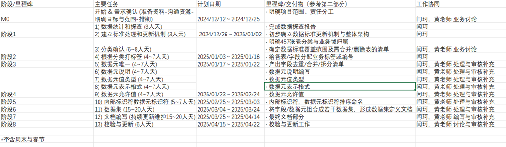

# 数据标准工作计划

## 一、说明
参考《数据标准统计和流程说明文件.xlsx》，目前尚有457张表未完成数据标准化工作，其中字段总数为5329个。字段级别信息含义、取值、类型需要定义并校验完成。本次数据标准化的主要工作如下评估。

## 二、主要任务与人天评估

以下按照项目的主要工作内容进行说明，包括预估的人天需求及甲乙双方的协作责任。每个阶段可存在一定重叠或并行，以缩短整体周期。

### 1. 数据统计和探查  
- **内容**：基础统计信息和业务范围统计以及查看数据特性。字段注释异常值统计，字段类型异常值分类处理，字段类型异常值统计等，提供分类参考方向和依据以及后续的数据标准处理
- **时间**：3人天  
- **协作**：乙方

### 2. 建立标准处理和更新机制和整体架构
- **内容**：建立数据标准更新机制和整体架构，包括数据标准文档的版本管理、数据标准的维护和更新机制等
- **时间**：3人天  
- **协作**：乙方主导，甲乙双方共同完成

[其他任务项保持相同格式...]

## 三、风险与注意事项
- 字段级别的信息大多需要人工确认核实，需要耗费大量时间
- 需反复与业务、甲方负责人沟通确认字段含义，尤其是字段名相同却实际含义不一的情况
- 历史系统文档缺失、表间关系不明等现象可能增加排查与确认时间，补齐信息等
- 同名字段在不同系统中，取值范围与类型乃至含义都有可能冲突，业务合并或者删除
- 数据标准维护不仅是一次性工作，需要在最终确定后安排后续更新流程

## 四、项目里程碑/排期

| 阶段/里程碑 | 主要任务 | 计划日期 | 里程碑/交付物 | 工作协同 | 工作地点 |
|------------|---------|----------|--------------|----------|----------|
| M0 | 开始 & 需求确认 (准备资料-沟通资源-明确目标与范围-排期) | 2024/12/12～2024/12/25 | · 明确项目范围、责任分工 | 闫珂，黄老师 业务讨论 | 远程 |
| 阶段1 | 1) 数据统计和探查 (3人天) 2) 建立标准处理和更新机制 (3人天) | 2024/12/26～2025/01/02 | · 完成数据探查报告 · 初步确立数据标准更新机制与整体架构 | 闫珂 | 远程 |
| 阶段2 | 3) 分类确认 (6~8人天) 4) 根据分类打标签 (4~7人天) | 2025/01/03～2025/01/16 | · 明确457张表分类与业务域归属 · 确定数据标准覆盖范围及需合并/删除表的清单 · 给各表/字段分配业务标签或编号 | 闫珂，黄老师 业务讨论 | 远程 |
| 阶段3 | 5) 数据元唯一 (4~7人天) | 2025/01/17～2025/01/22 | · 产出字段去重/合并/拆分清单 | 闫珂，黄老师 处理与审核补充 | 远程 |
| 阶段4 | 6) 数据元说明 (4~7人天) 7) 数据元值类型 (4~7人天) 8) 数据元表示格式 (4~7人天) 9) 数据元允许值 (4~7人天) | 2025/01/23～2025/02/24 | · 数据元说明编写 · 数据元值类型 · 数据元表示格式 · 数据元允许值 | 闫珂，黄老师 处理与审核补充 | 远程 |
| 阶段5 | 10) 内部标识符数据元标识符 (5~7人天) | 2025/02/25～2025/03/03 | · 内部标识符，数据元标识符排序命名 | 闫珂，黄老师 处理与审核补充 | 远程 |
| 阶段6 | 11) 数据集 (15~20人天) | 2025/03/04～2025/03/24 | · 将字段/数据元组合成若干数据集，形成数据集定义文档 | 闫珂，黄老师 处理与审核补充 | 远程 |
| 阶段7 | 12) 文档编写 (持续更新维护15~20人天) | 2025/03/25～2025/04/14 | · 最终文档部分 | 闫珂，黄老师 编写与审核补充 | 远程 |
| 阶段8 | 13) 校验与更新 (6人天) | 2025/04/15～2025/04/22 | · 校验与更新工作 | 闫珂，黄老师 讨论与审核补充 | 远程 |

*不含周末与春节

注：
1. 合计约90人天~110人天
2. 每个阶段可存在一定重叠或并行，以缩短整体周期
3. 上表仅做参考，具体排期视实际沟通效率与资源投入为准，执行到某一阶段可能有小幅变更和调整以实际为准

## 五、数据清洗服务计划
该服务为单独模块

### 工作内容
1. 2024数据处理 (7~15人天)
2. 测试环境部署 (5人天)
3. 培训 (7~21人天)
   - 脚本熟悉和使用
   - 环境熟悉和使用到应用数据清洗
   - 数据标准

### 基本信息
- **工作地点**：现场
- **计划时间**：2025/2~2025/4
- **周期**：1-2个月

