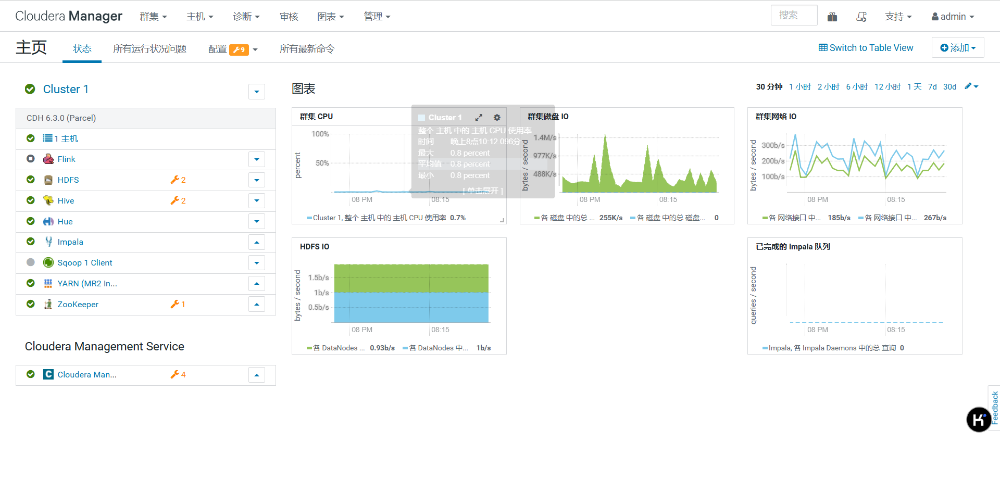
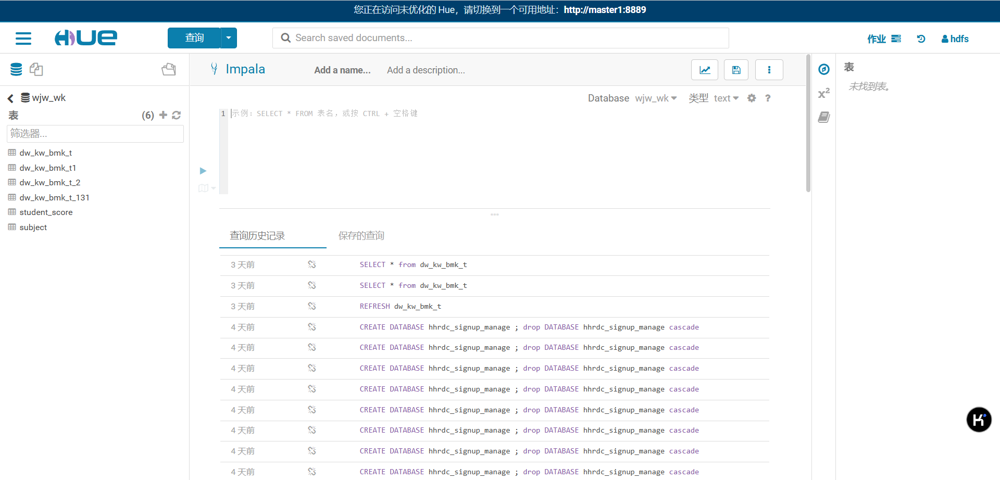

# 大数据平台说明

二次开发国产化

https://www.cloudera.com/

## 一、组件简介

平台基于 CDH 6.3.0 (Parcel) 版本搭建，包含以下组件：

### 1. 存储组件
- HDFS：分布式文件存储系统
  - NameNode：1台，负责管理文件系统的命名空间和客户端对文件的访问
  - DataNode：3台，负责数据的存储和读写操作
  - 存储容量：每台服务器配置 10TB 存储空间

### 2. 计算组件
- YARN：资源调度管理系统
  - ResourceManager：1台，负责整个集群的资源管理和调度
  - NodeManager：3台，负责单个节点的资源管理和任务执行

### 3. 查询组件
- Hive：数据仓库工具，提供 SQL 查询功能
- Impala：实时交互式 SQL 查询引擎
- Sqoop：数据迁移工具，用于在 HDFS 和关系型数据库之间传输数据

### 4. 管理组件
- ZooKeeper：分布式协调服务
- Cloudera Manager：集群管理和监控平台

### 5. 其他组件
- Hue：Web 界面操作平台

## 二、节点规划
| 节点 | 主机名 | IP地址 | 安装服务 |
|------|---------|---------|-----------|
| Node1 | master | xxx.xxx.xxx.xxx | NameNode,DataNode，ResourceManager, NodeManager, HiveServer2, Hue, Hive Client,impala,zookeeper |
| Node2 | agent1 | xxx.xxx.xxx.xxx | DataNode, NodeManager, Impala, Hive Client,zookeeper |
| Node3 | agent2 | xxx.xxx.xxx.xxx | DataNode, NodeManager, Impala, Hive Client,zookeeper |
