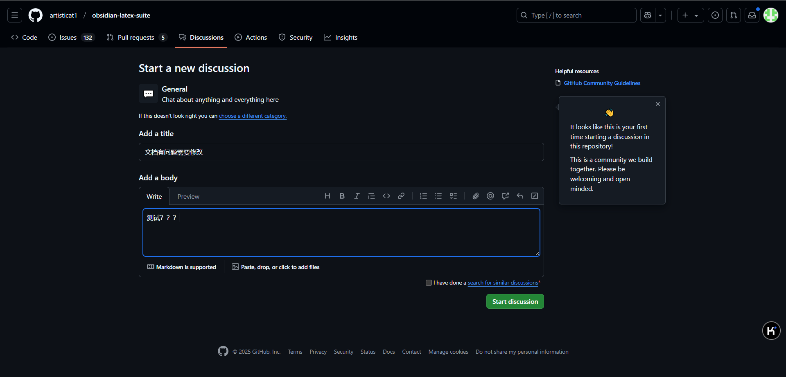

## 📝 仓库说明

本仓库用于部分信息在客户和公司之间同步分享和版本管理，资料同步、整理工作和学习笔记、培训资料、记录技术文档以及分享工作流程，不包含隐私数据、安全敏感信息、个人身份信息、业务核心数据和机密文档。

## 📌 免责声明
本仓库中的所有内容仅供学习和工作参考，不涉及任何敏感信息或隐私数据。如有疑问，请及时联系仓库维护者删除。

## 🔍 使用说明
1. 如需补充或修改文档，您可以通过以下方式参与：
    - 在项目的 Discussions 中发起讨论

    

